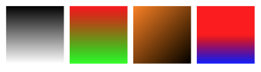

A small UIView helper to create simple linear gradients.

[](http://forthebadge.com) [](http://forthebadge.com)

[](http://cocoadocs.org/docsets/Fluorine)
[](http://cocoadocs.org/docsets/Fluorine)
[](https://cocoapods.org/pods/Fluorine/quality)
[](https://travis-ci.org/e-sites/Fluorine)


# Installation

Podfile:

```ruby
pod 'Fluorine'
```

And then

```
pod install
```

# Implementation

The following code will make 4 gradient views:    


```swift
let view1 = Fluorine.View(frame: CGRect(x: 50, y: 50, width: 100, height: 100))
self.view.addSubview(view1)

let view2 = Fluorine.View(frame: CGRect(x: 160, y: 50, width: 100, height: 100))
view2.colors = [ UIColor.red, UIColor.green, UIColor.blue ]
self.view.addSubview(view2)

let view3 = Fluorine.View(frame: CGRect(x: 270, y: 50, width: 100, height: 100))
view3.colors = [ UIColor.orange, UIColor.black ]
view3.point = Fluorine.Point(start: CGPoint.zero, end: CGPoint(x: 1, y: 1))
self.view.addSubview(view3)

let view4 = Fluorine.View(frame: CGRect(x: 380, y: 50, width: 100, height: 100))
view4.colors = [ UIColor.red, UIColor.blue ]
view4.locations = [ 0.5, 1 ]
self.view.addSubview(view4)
```